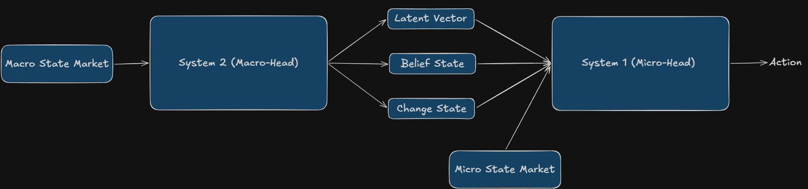

> **Note:** A paper about this project will be available soon.

This repository is an experimentation of a new variant of PPO (Proximal Policy Optimisation) called PPO-Belief. In this work, we introduce a new auxiliary task “Belief”, it learns to predict the hidden state in a partially observable environment. Also we can see if this architecture can perform in an environment with a lot of hidden state like financial market or physics.

We evaluate this algorithm on the financial market for trading Bitcoin. We chose to trade Bitcoin, because it is known as the asset with the most volatility. We want to see if our algorithm outperforms PPO in this environment.

## Architecture



We introduce system-1 and system-2 architecture. The system-2 takes as input a set of macro states market, it predicts the regime and change in market state for next time step. The system-1 takes as input a set of micro states markets, the latent vector and predictions from system-2 to select actions in the environment (buy, hold, short).

- **System 2** (`MacroHead`): Classifies market regime (Stable/Volatile/Crisis) and predicts imminent changes. Pre-trained on 2015-2018 data.
- **System 1** (`Agent`): PPO agent that fuses micro features (hourly data via LSTM) with macro context to decide the next action.

## Installation

### 1. Clone the repository

```bash
git clone git@github.com:Dar-rius/Kairos.git
cd Kairos
```

### 2. Data

Data is not included in the repository, you can download data from Hugging Face [here](https://huggingface.co/datasets/Darrius2020/RL_quant_btc).

Place your CSV files in `data_off/train_test/`:

```
data_off/train_test/
├── price_train.csv          # Hourly training data (2018-2023)
├── price_test.csv           # Hourly test data (2023-2026)
├── metric_pretrain.csv      # Macro metrics pretrain (2015-2018)
├── metric_train.csv         # Macro metrics training (2018-2023)
└── metric_test.csv          # Macro metrics test (2023-2026)
```

To preprocess raw data into separate CSVs:

```bash
uv run python script.py
```

### 3. Build and executate container

Uses the NVIDIA PyTorch container (`nvcr.io/nvidia/pytorch:25.08-py3`).

```bash
# Build container
docker build -t kairos .

# Executate the container
./run.sh
```

## Training Pipeline

### Step 1: Train MacroHead (System 2)

```bash
#Train the macro head (system 2)
python3 pretrain.py
```

**Outputs**:

- `agent/save/macro_head.pt` — Model weights
- `agent/save/macro_scaler.pkl` — StandardScaler for macro features
- `runs/train_macro/` — Confusion matrices

### Step 2: Train the Agent (System 1)

```bash
python3 train.py
```

**Prerequisite**: `wandb` login required (for metric logging).

**Outputs**:

- `agent/save/agent_saved.pt` — Agent weights
- `agent/save/macro_head_1.pt` — MacroHead copy after fine-tuning

### Step 3: Backtest

```bash
python3 back_test.py
```

**Outputs**:

- `runs/test/backtest_result_{timestamp}.png` — Backtest chart

## Project Structure

```
Kairos/
├── agent/
│   ├── model.py              # MacroHead, Agent, FocalLoss
│   ├── ppo_belief.py         # PPO algorithm with auxiliary losses
│   ├── buffer.py             # Rollout buffer (pre-allocated tensors)
│   ├── save/                 # Saved weights (gitignored)
│   └── __init__.py
├── rl_trade/
│   ├── env.py                # Trading environment
│   ├── compute.py            # DSR reward, Sharpe ratio, max drawdown, fees and unit conversions
│   └── __init__.py
├── data_off/
│   └── train_test/           # Datasets (gitignored)
├── runs/
│   └── test/                 # Backtest charts
├── pretrain.py       # System 2 training
├── train_agent.py            # System 1 training
├── back_test.py             # Backtest
├── search_hyperparams_agent.py    # Optuna for Agent
├── search_hyperparams_macro.py     # Optuna for MacroHead
├── visualizer.py             # wandb visualizations (3D scatter)
├── script.py                 # Data preprocessing
├── pyproject.toml            # uv configuration
├── requirements.txt          # Full dependencies
└── dockerfile                # NVIDIA Docker image
```
